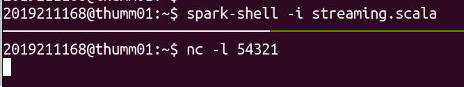
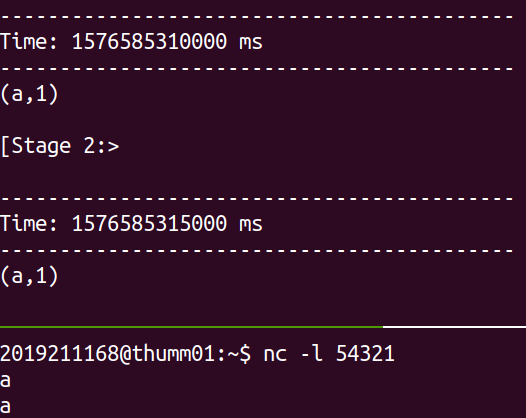
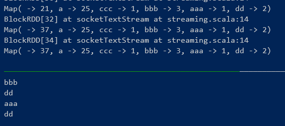
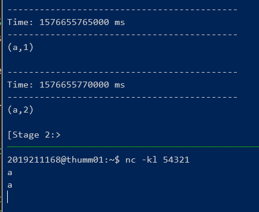
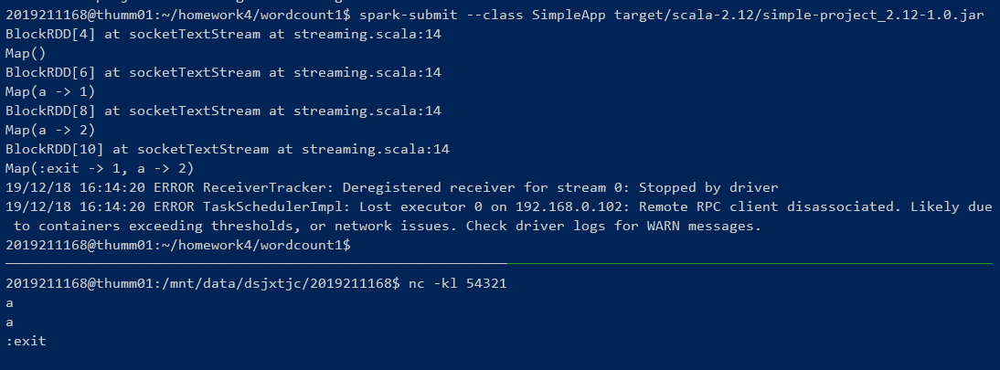

# 大数据系统基础

## 实验四： Spark Streaming

### 邹永浩 2019211168

#### 任务1 Spark Streaming 词频统计

使用的代码如下：
```scala
import org.apache.spark.streaming._
val ssc = new StreamingContext(sc, Seconds(5))
val lines = ssc.socketTextStream("thumm01", 54321)
val result = lines.flatMap(_.split(" ")).map(w => (w, 1)).reduceByKey(_ + _)
result.print()
ssc.start()
```

分别启动 `nc` 和 `spark-shell`



此时统计效果为统计5秒内的词频



#### 任务2 累加词频统计

若要支持累加词频统计，有很多方法，最简单的为使用 `CollectionAccumulator`

```scala
object SimpleApp {
  def main(args: Array[String]) {
    val sparkConf = new SparkConf()
      .setAppName("wordcount1")
    val sc = new SparkContext(sparkConf)
    val ssc = new StreamingContext(sc, Seconds(5))
    val lines = ssc.socketTextStream("thumm01", 54321)
    val wordAccumulator = new CollectionAccumulator[String]()
    ssc.sparkContext.register(wordAccumulator, "words")

    lines.foreachRDD { line =>
      line.flatMap(l => l.split(" "))
      .foreach(i => {
        wordAccumulator.add(i)
      })
      println(wordAccumulator.value.toArray
            .groupBy(w => w).map(w => (w._1, w._2.size)))
    }
    ssc.start()
    ssc.awaitTermination()
  }
}
```

这里要使用 `sbt` 工具打包后使用 `spark-submit`提交任务，根据我的测试，在`spark-shell`中使用 `Accumulator` 和广播变量，会出现无法序列化的错误。

任务提交后，在 driver 端就可以看到累加器的值



还有一种方法为官网使用`StateDStream`的例子，如下：

```scala
import org.apache.spark.streaming._
val updateFunc = (values: Seq[Int], state: Option[Int]) => {
  val currentCount = values.foldLeft(0)(_ + _)
  val previousCount = state.getOrElse(0)
  Some(currentCount + previousCount)
}

val ssc = new StreamingContext(sc, Seconds(5))
ssc.checkpoint(".")
val lines = ssc.socketTextStream("thumm01", 54321)
val words = lines.flatMap(_.split(" "))
val wordDstream = words.map(x => (x, 1))
val stateDstream = wordDstream.updateStateByKey[Int](updateFunc)
stateDstream.print()
ssc.start()
```

这种方法也可实现同样效果



#### 任务3 :exit 退出流处理程序

因为 `ssc.stop()` 必须在 driver 端执行，因此我们可以使用一个 `Accumulator` 来标识是否需要停止。如果收到停止指令，令该 `Accumulator` 加1，driver 端判断累加器的值，如果大于零则停止。代码如下：

```scala
object SimpleApp {
  def main(args: Array[String]) {
    val sparkConf = new SparkConf().setAppName("wordcount1")
    val sc = new SparkContext(sparkConf)
    val ssc = new StreamingContext(sc, Seconds(5))
    val lines = ssc.socketTextStream("thumm01", 54321)
    val wordAccumulator = new CollectionAccumulator[String]()
    val shutdownAccumulator = new LongAccumulator()
    ssc.sparkContext.register(wordAccumulator, "words")
    ssc.sparkContext.register(shutdownAccumulator, "shutdownAccumulator")

    lines.foreachRDD { line =>
      println(line)
      line.flatMap(l => l.split(" "))
        .foreach(i => {
          wordAccumulator.add(i)
          if (i == ":exit") {
            shutdownAccumulator.add(1)
          }
        })
      println(
        wordAccumulator.value.toArray
          .groupBy(w => w)
          .map(w => (w._1, w._2.size))
      )
      if (shutdownAccumulator.value > 0) {
        ssc.stop()
        println("Application stopped!")
      }
    }
    ssc.start()
    ssc.awaitTermination()
  }
}
```

效果如下：

